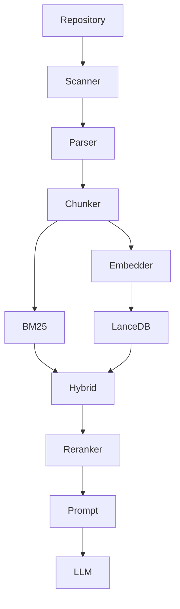

# AGENTS.md — Mini Coding Agent Implementation Guide

## 1. Project Mission

You are implementing an educational local AI coding assistant called `coding_agent`.

The purpose is **not** to clone Cursor, Continue, Cline, Copilot, Claude Code, or Windsurf.

The purpose is to build a small but architecturally serious coding assistant that allows an engineer to understand how modern AI coding assistants work internally.

Prioritize:

1. Clear architecture
2. Modularity
3. Testability
4. Explainability
5. Replaceable components
6. Local execution
7. Minimal framework usage
8. Strong type safety
9. Explicit interfaces
10. Educational value

Avoid unnecessary abstractions and frameworks.

Every major subsystem must have a clearly defined responsibility and interface.

---

# 2. Current Repository Structure

The repository currently looks like:

```text
coding_agent/
├── .github/
│   └── AGENTS.md
├── .gitignore
├── pyproject.toml
├── README.md
├── uv.lock
└── src/
    ├── __init__.py
    ├── app.py
    └── coding_agent/
        ├── __init__.py
        ├── app.py
        ├── models/
        │   ├── ast.py
        │   ├── file.py
        │   ├── language.py
        │   └── repository.py
        ├── parser/
        │   ├── parser.py
        │   └── registry.py
        ├── scanner/
        │   ├── ignore.py
        │   ├── language.py
        │   ├── scanner.py
        │   └── walker.py
        └── utils/
            └── hashing.py
```

Preserve this package-oriented architecture.

As the project grows, extend it rather than collapsing everything into large files.

---

# 3. Technology Requirements

Use:

* Python 3.12+
* `uv`
* Tree-sitter
* Sentence Transformers
* LanceDB
* rank-bm25
* LangGraph
* LangChain only where it provides clear value
* Pydantic
* Rich
* Typer
* GitPython

Do not introduce large frameworks without a concrete architectural reason.

The LLM is the only component that may communicate with an external service.

Everything else should run locally.

---

# 4. Architectural Principle

The complete system should eventually look like:

```text
                         CLI
                          │
                          ▼
                    Agent / Graph
                          │
             ┌────────────┼─────────────┐
             │            │             │
             ▼            ▼             ▼
          Planner       Memory         Tools
             │
             ▼
         Retrieval
             │
      ┌──────┴───────┐
      ▼              ▼
 Semantic Search   BM25 Search
      │              │
      ▼              ▼
   LanceDB       Keyword Index
      │              │
      └──────┬───────┘
             ▼
        Score Fusion
             │
             ▼
          Reranker
             │
             ▼
       Prompt Builder
             │
             ▼
            LLM
             │
             ▼
           Answer
```

Indexing is a separate pipeline:

```text
Repository
    │
    ▼
Scanner
    │
    ▼
FileMetadata
    │
    ▼
Tree-sitter Parser
    │
    ▼
Syntax Tree
    │
    ▼
Symbol Extraction
    │
    ▼
AST-aware Chunker
    │
    ├───────────────┐
    ▼               ▼
Embeddings        BM25
    │               │
    ▼               ▼
 LanceDB       Keyword Index
```

Do not tightly couple these stages.

---

# 5. General Coding Rules

## 5.1 Type hints

Use type hints throughout.

Prefer:

```python
def search(query: str, top_k: int = 10) -> list[SearchResult]: ...
```

over untyped functions.

Use modern Python typing.

---

## 5.2 Pydantic

Use Pydantic models for data crossing subsystem boundaries where validation/serialization is useful.

Use dataclasses where a simple internal immutable structure is sufficient.

Do not blindly use Pydantic for every object.

---

## 5.3 Async

Do not introduce async merely for style.

Use synchronous code for local filesystem, parsing, BM25 and LanceDB operations unless there is a demonstrated need.

LLM calls and parallel retrieval may later benefit from async.

---

## 5.4 Errors

Do not silently swallow unexpected exceptions.

Handle expected errors explicitly.

Bad:

```python
try:
    ...
except Exception:
    pass
```

Good:

```python
except PermissionError:
    ...
```

---

## 5.5 Logging

Use Rich-based logging/console output through a central utility.

Do not scatter raw `print()` statements throughout the application.

---

## 5.6 Configuration

Do not hard-code:

* embedding model
* LLM provider
* LLM model
* repository path
* vector database location
* top-k
* token budget
* ignore patterns

Put configuration behind `config.py`.

Environment variables may override configuration.

Never hard-code API keys.

---

# 6. PHASE 4 — Complete AST Parsing

The existing Tree-sitter work must be completed.

Support:

* Python
* Java
* JavaScript
* TypeScript
* Go
* Rust

Create language-specific parsing/extraction implementations as necessary.

Recommended structure:

```text
parser/
├── parser.py
├── registry.py
├── tree_sitter.py
└── languages/
    ├── __init__.py
    ├── python.py
    ├── java.py
    ├── javascript.py
    ├── typescript.py
    ├── go.py
    └── rust.py
```

Do not force different language ASTs into one fake Tree-sitter AST.

Instead, normalize their meaningful concepts into our own domain model.

---

## 6.1 Required extracted information

For each source file extract:

* imports
* packages/modules
* classes
* interfaces
* functions
* methods
* constructors
* fields where practical
* comments
* docstrings
* annotations/decorators where practical
* symbol names
* parent symbol
* source locations

Every symbol must have:

```text
name
kind
start_line
end_line
parent
```

Add useful metadata where available.

---

## 6.2 Symbol model

Create a normalized model similar to:

```python
class Symbol:
    name: str
    kind: SymbolKind
    start_line: int
    end_line: int
    parent: str | None
```

Use an enum for symbol kinds.

Possible values:

```text
CLASS
INTERFACE
FUNCTION
METHOD
CONSTRUCTOR
FIELD
ENUM
MODULE
IMPORT
VARIABLE
```

Do not require every language to support every symbol kind.

---

## 6.3 Parser contract

The rest of the system must not depend directly on Tree-sitter APIs.

The Tree-sitter implementation belongs behind the parser abstraction.

The goal is:

```text
FileMetadata
      │
      ▼
SourceParser
      │
      ▼
ParsedFile / SyntaxTree
```

not:

```text
Entire application
      │
      ├── tree_sitter.Node
      ├── tree_sitter.Node
      └── tree_sitter.Node
```

---

## 6.4 Parser tests

Test at least:

* Java class
* Java interface
* Java methods
* Java imports
* Python class
* Python functions
* Python decorators
* JavaScript functions
* TypeScript classes
* Go functions
* Rust functions

Test exact line ranges.

Test malformed source.

Tree-sitter should not crash the indexing pipeline merely because a file contains syntax errors.

---

# 7. PHASE 5 — AST-Aware Chunking

Create:

```text
src/coding_agent/chunker/
```

Suggested structure:

```text
chunker/
├── __init__.py
├── chunker.py
└── models.py
```

The chunker converts parsed source structures into retrieval units.

---

## 7.1 Core rule

NEVER split source code arbitrarily by character count as the primary chunking strategy.

Do not do:

```python
source[i : i + 1000]
```

for normal source-code chunks.

Chunks should be based on AST/symbol boundaries.

---

## 7.2 Chunk model

Each chunk must contain:

```text
chunk_id
path
language
class_name
function_name
symbol
symbol_kind
parent_symbol
start_line
end_line
imports
comments
code
metadata
```

Use a stable chunk ID.

Prefer a deterministic ID based on repository-relative path + symbol/location.

---

## 7.3 Chunk hierarchy

Prefer:

```text
File
 ├── Class
 │    ├── Method
 │    ├── Method
 │    └── Field
 │
 └── Function
```

A method/function should normally become its own chunk.

Classes/interfaces should be represented as chunks where useful.

---

## 7.4 Large methods

A method may itself be enormous.

Do not abandon AST-aware chunking.

If a method exceeds the configured token/size budget:

```text
Large Method
     │
     ├── preserve method metadata
     ├── split at nested AST boundaries where possible
     └── use conservative fallback only when necessary
```

Never blindly slice source in the middle of a semantic construct if an AST boundary is available.

---

## 7.5 Chunk context

A method chunk should retain enough context to be useful:

```text
package
imports
class name
method signature
method body
comments/docstring
```

Avoid repeating huge imports or entire classes unnecessarily.

---

## 7.6 Chunk tests

Test:

* class chunk
* method chunk
* nested class
* interface
* standalone Python function
* class method
* imports
* comments/docstrings
* large method
* stable chunk IDs
* exact line ranges

---

# 8. PHASE 6 — Embedding Layer

Create:

```text
src/coding_agent/embedding/
├── __init__.py
├── embedder.py
└── models.py
```

Use Sentence Transformers.

Default model:

```text
BAAI/bge-small-en-v1.5
```

Allow configuration.

---

## 8.1 Interface

Create a generic interface:

```python
class Embedder(ABC):
    @abstractmethod
    def embed_text(self, text: str) -> list[float]: ...

    @abstractmethod
    def embed_batch(self, texts: list[str]) -> list[list[float]]: ...
```

The rest of the system must not depend directly on Sentence Transformers.

---

## 8.2 Embedding input

Do not embed only the raw method body.

Construct an embedding representation containing useful metadata.

For example:

```text
Language: Java
Path: src/user/UserService.java
Class: UserService
Symbol: findUser
Kind: method

public User findUser(Long id) {
    ...
}
```

Experiment with representations later.

Keep this formatting logic outside the embedding model.

---

## 8.3 Batch embedding

Support batching.

Do not invoke the model once per chunk if batch inference is available.

Bad:

```python
for chunk in chunks:
    model.encode(chunk)
```

Prefer:

```python
model.encode(texts, batch_size=...)
```

---

## 8.4 Embedding tests

Do not make normal unit tests download large models repeatedly.

Create:

* mocked embedder tests
* shape/dimension tests
* deterministic interface tests

Use an integration test separately for the real model.

---

# 9. PHASE 7 — LanceDB Vector Store

Create:

```text
src/coding_agent/vector_store/
├── __init__.py
├── store.py
└── models.py
```

Use LanceDB.

Table:

```text
CodeChunk
```

Columns:

```text
id
vector
path
language
symbol
start_line
end_line
text
metadata
```

Add useful fields where justified.

---

## 9.1 Interface

Create a repository-like abstraction:

```python
class VectorStore(ABC):
    def upsert(self, chunks: list[EmbeddedChunk]) -> None: ...

    def delete(self, ids: list[str]) -> None: ...

    def search(
        self,
        vector: list[float],
        top_k: int,
    ) -> list[SearchResult]: ...
```

Support:

* insert
* update
* upsert
* delete
* search
* clear/rebuild
* stats

---

## 9.2 Re-indexing

Re-indexing must not produce duplicate records.

Use deterministic IDs and upsert semantics.

---

## 9.3 Vector-store tests

Test:

* insert
* upsert
* update
* delete
* empty store
* top-k search
* metadata preservation
* duplicate IDs
* rebuild

Use a temporary LanceDB directory.

---

# 10. PHASE 8 — BM25 Keyword Search

Create:

```text
src/coding_agent/search/
├── __init__.py
├── keyword.py
├── semantic.py
├── hybrid.py
└── models.py
```

Use `rank-bm25`.

---

## 10.1 BM25 corpus

Index a searchable representation containing:

* class names
* method names
* function names
* identifiers
* comments
* docstrings
* imports
* path
* code

Identifiers should remain searchable.

Example:

```text
UserService findUser UserRepository repository
```

should match a query:

```text
UserService findUser
```

very strongly.

---

## 10.2 Tokenization

Implement a sensible code-aware tokenizer.

Consider:

```text
camelCase
PascalCase
snake_case
kebab-case
qualified.names
```

For example:

```text
findUserById
```

should produce useful lexical terms such as:

```text
findUserById
find
user
by
id
```

Do not destroy the original identifier.

---

## 10.3 BM25 interface

Expose:

```python
search(query: str, top_k: int) -> list[SearchResult]
```

---

# 11. PHASE 9 — Semantic Search

Create a semantic retriever around the embedder + vector store.

Flow:

```text
User Query
    │
    ▼
Embed Query
    │
    ▼
Vector Search
    │
    ▼
Top K Chunks
```

Return:

```text
chunk
similarity score
```

Do not hide retrieval scores.

They will be useful for debugging.

---

# 12. PHASE 10 — Hybrid Search

Hybrid search combines:

```text
BM25
+
Semantic Search
```

Architecture:

```text
                    Query
                      │
              ┌───────┴────────┐
              ▼                ▼
           BM25            Embedding
              │                │
              ▼                ▼
        lexical results   semantic results
              │                │
              └───────┬────────┘
                      ▼
                 normalization
                      │
                      ▼
                  score fusion
                      │
                      ▼
                 deduplication
                      │
                      ▼
                    top-k
```

---

## 12.1 Score normalization

Do not directly add BM25 scores to vector similarity scores.

They are on different scales.

Implement a normalization strategy.

Start with min-max normalization:

```text
normalized =
    (score - min_score) /
    (max_score - min_score)
```

Handle the case where all scores are identical.

---

## 12.2 Fusion

Start with weighted fusion:

```text
final_score =
    alpha * semantic_score
    +
    (1 - alpha) * bm25_score
```

Make `alpha` configurable.

Example:

```text
alpha = 0.7
```

means semantic retrieval has more influence.

Do not assume this is optimal.

The system should make experimenting easy.

---

## 12.3 Deduplication

The same chunk may appear in both result sets.

Deduplicate by stable `chunk_id`.

Preserve both component scores for debugging:

```text
semantic_score
bm25_score
final_score
```

---

# 13. PHASE 11 — Re-ranking

Create:

```text
src/coding_agent/reranker/
├── __init__.py
├── reranker.py
└── score_fusion.py
```

Define:

```python
class Reranker(ABC):
    @abstractmethod
    def rerank(
        self,
        query: str,
        results: list[SearchResult],
        top_k: int,
    ) -> list[SearchResult]: ...
```

Initially implement a simple score-based reranker.

Architecture must allow:

```text
ScoreFusionReranker
CrossEncoderReranker
BGEReranker
LLMReranker
```

later.

Do not make the retrieval system depend directly on one reranking model.

---

# 14. PHASE 12 — Prompt Builder

Create:

```text
src/coding_agent/prompt/
├── __init__.py
├── builder.py
└── models.py
```

Prompt construction must be a separate component.

Input:

```text
User question
Retrieved chunks
Conversation summary
Repository metadata
System instructions
```

Output:

```text
LLM request
```

---

## 14.1 Context format

Use a predictable format:

````text
<repository_context>

FILE: src/user/UserService.java
LANGUAGE: java
SYMBOL: UserService.findUser
LINES: 20-28

```java
...
````

</repository_context>

````

Do not dump arbitrary raw text into the prompt.

---

## 14.2 Token budgeting

Create a configurable token budget.

Approximate token counting is acceptable initially.

The builder must guarantee that retrieved context is bounded.

Conceptually:

```text
context window
├── system prompt
├── conversation
├── repository context
├── user question
└── response allowance
````

Do not assume the entire model context can be consumed by retrieved code.

---

## 14.3 Context selection

If too many chunks are retrieved:

1. preserve highest-ranked chunks
2. avoid duplicate files where possible
3. prefer complementary context
4. respect token budget

Keep this logic deterministic initially.

---

# 15. PHASE 13 — LLM Provider Abstraction

Create:

```text
src/coding_agent/llm/
├── __init__.py
├── client.py
├── models.py
└── providers/
    ├── openai.py
    ├── anthropic.py
    ├── gemini.py
    ├── groq.py
    ├── ollama.py
    └── lmstudio.py
```

Do not require all providers to be implemented immediately.

Implement a generic interface first.

---

## 15.1 Interface

Conceptually:

```python
class LLMClient(ABC):
    @abstractmethod
    def complete(
        self,
        messages: list[Message],
        tools: list[ToolDefinition] | None = None,
    ) -> LLMResponse: ...
```

Support:

* text generation
* tool calls
* model metadata
* usage/token counts
* latency

---

## 15.2 Provider order

Implement initially:

1. OpenAI-compatible provider
2. Ollama
3. one additional cloud provider

Then add others using the same interface.

Do not create provider-specific logic throughout the agent.

---

# 16. PHASE 14 — Conversation Memory

Create:

```text
src/coding_agent/memory/
├── __init__.py
├── memory.py
└── summary.py
```

Support:

### Short-term history

```text
user
assistant
user
assistant
```

### Rolling summary

When history becomes too large:

```text
old conversation
       │
       ▼
summary
       │
       ▼
recent messages
```

The agent should retain:

* user goals
* important decisions
* relevant code references
* unresolved questions

Do not retain arbitrary enormous raw history forever.

---

# 17. PHASE 15 — Tools

Create:

```text
src/coding_agent/tools/
├── __init__.py
├── base.py
├── filesystem.py
├── search.py
├── terminal.py
├── git.py
└── code_navigation.py
```

Implement:

* Read File
* Write File
* List Directory
* Search Files
* Search Symbols
* Run Terminal Command
* Git Status
* Git Diff
* Run Tests
* Find References
* Find Definition

---

## 17.1 Tool contract

Every tool should have:

```text
name
description
typed input
typed output
validation
error handling
permission/safety policy
```

Use Pydantic schemas where useful.

---

## 17.2 Read File

Input:

```text
path
start_line
end_line
```

Do not expose arbitrary filesystem paths outside the repository.

---

## 17.3 Write File

Writing must be explicit.

Validate:

```text
path is inside repository
```

Prevent path traversal:

```text
../../etc/passwd
```

Never allow that.

---

## 17.4 Terminal

Terminal execution is potentially dangerous.

Implement a policy layer.

At minimum:

* execute relative to repository root
* timeout
* capture stdout
* capture stderr
* return exit code
* limit output
* clearly identify command execution

Do not silently execute arbitrary destructive commands.

The agent must never automatically run dangerous commands merely because an LLM generated them.

---

## 17.5 Git

Use GitPython where appropriate.

Support:

```text
git status
git diff
```

without shelling out unnecessarily.

---

# 18. PHASE 16 — Code Navigation

Implement lightweight code navigation using our AST/index.

Support:

```text
find_definition(symbol)
find_references(symbol)
search_symbols(query)
```

Initially this does not need to become a full LSP.

Use:

* symbol index
* AST information
* lexical search

Later leave an extension point for LSP integration.

---

# 19. PHASE 17 — Planner

Create:

```text
src/coding_agent/planner/
├── __init__.py
├── planner.py
└── models.py
```

The initial planner should be deliberately simple.

Example:

```text
Question
   │
   ▼
Does this require repository context?
   │
   ├── No ──────────────► LLM/direct answer
   │
   └── Yes
         │
         ▼
     Retrieve
         │
         ▼
    Is a tool required?
         │
      ┌──┴──┐
      ▼     ▼
     Yes    No
      │      │
      ▼      ▼
    Tool    LLM
      │
      ▼
    LLM
```

Do not build a sophisticated autonomous planner initially.

The goal is to understand the control loop.

---

# 20. PHASE 18 — LangGraph Agent

Only introduce LangGraph after the individual components work independently.

The graph should conceptually look like:

```text
START
  │
  ▼
Analyze Question
  │
  ▼
Retrieve?
  │
 ┌┴───────────┐
 │            │
No           Yes
 │            │
 │            ▼
 │         Retrieve
 │            │
 └─────┬──────┘
       ▼
   Need Tool?
       │
    ┌──┴──┐
    │     │
   No    Yes
    │     │
    │     ▼
    │   Execute Tool
    │     │
    └──┬──┘
       ▼
    Build Prompt
       │
       ▼
       LLM
       │
       ▼
      END
```

Later the graph can support:

```text
tool call
   ↓
observe result
   ↓
reason
   ↓
another tool
   ↓
...
```

This is the beginning of the agent loop.

---

# 21. PHASE 19 — CLI

Use Typer.

Commands:

```bash
python -m coding_agent index
python -m coding_agent chat
python -m coding_agent search "Where is UserService?"
python -m coding_agent inspect
python -m coding_agent stats
python -m coding_agent reindex
```

Or preserve the project's existing `mini-agent` entrypoint.

---

## 21.1 index

Example:

```bash
mini-agent index /path/to/repository
```

Pipeline:

```text
scan
 ↓
parse
 ↓
extract symbols
 ↓
chunk
 ↓
embed
 ↓
store vectors
 ↓
build BM25
```

Display progress with Rich.

---

## 21.2 search

Example:

```bash
mini-agent search "Where is UserService?"
```

Display:

```text
1. src/user/UserService.java
   UserService
   lines 12-40
   semantic: 0.91
   bm25:     0.83
   final:    0.88

2. src/user/UserController.java
   ...
```

---

## 21.3 stats

Display:

```text
Repository
────────────────────────
Files:              842
Chunks:           4,293
Java:               421
Python:             193
TypeScript:         102

Index
────────────────────────
Vector records:   4,293
BM25 records:     4,293

Timing
────────────────────────
Scan:               0.8s
Parse:              2.1s
Embedding:         18.4s
Vector insert:      1.7s
```

---

# 22. PHASE 20 — Observability

Create:

```text
src/coding_agent/observability/
```

Track:

* scan latency
* parse latency
* chunk count
* embedding latency
* embedding batch size
* vector search latency
* BM25 latency
* hybrid search latency
* reranking latency
* prompt construction latency
* LLM latency
* tool latency
* token usage
* retrieved chunk count

Use structured timing objects rather than scattered timers.

---

# 23. PHASE 21 — Testing

Tests must be organized by subsystem:

```text
tests/
├── scanner/
├── parser/
├── chunker/
├── embedding/
├── vector_store/
├── search/
├── reranker/
├── prompt/
├── llm/
├── memory/
├── tools/
├── planner/
└── agent/
```

---

## 23.1 Unit tests

Every subsystem must have isolated unit tests.

Do not require an LLM for ordinary unit tests.

Do not require internet access for ordinary unit tests.

Do not download embedding models for every test.

---

## 23.2 Integration tests

Add separate integration tests for:

```text
scanner → parser
parser → chunker
chunker → embedder
embedder → LanceDB
BM25 → hybrid
retrieval → prompt
agent → tool
```

Mark expensive/internet-dependent tests appropriately.

---

## 23.3 End-to-end test

Create a tiny fixture repository:

```text
tests/fixtures/sample_repo/
├── src/
│   ├── User.java
│   ├── UserService.java
│   └── UserController.java
├── tests/
│   └── UserServiceTest.java
├── README.md
└── pom.xml
```

The complete pipeline should be able to answer:

```text
Where is UserService defined?
```

and:

```text
How does findUser work?
```

The answer should reference actual files and line ranges.

---

# 24. PHASE 22 — Documentation

Create:

```text
docs/
├── architecture.md
├── indexing.md
├── parsing.md
├── chunking.md
├── embeddings.md
├── retrieval.md
├── hybrid-search.md
├── reranking.md
├── prompting.md
├── llm.md
├── memory.md
├── tools.md
├── agents.md
├── security.md
└── performance.md
```

Explain not merely what the code does, but why it exists.

---

## 24.1 Required diagrams

Use Mermaid diagrams in Markdown.

Create:

### Architecture



### Indexing sequence

Show:

```text
CLI
Scanner
Parser
Chunker
Embedder
VectorStore
BM25
```

### Query sequence

Show:

```text
User
Agent
Planner
Retriever
PromptBuilder
LLM
Tools
```

### Agent loop

Show:

```text
Question
→ reason
→ retrieve/tool
→ observe
→ reason
→ answer
```

---

# 25. Security Requirements

Treat security as a first-class concern.

The coding assistant may eventually send source code to a cloud LLM.

Therefore:

* respect `.gitignore`
* support explicit ignore patterns
* exclude binary files
* exclude secrets
* prevent path traversal
* restrict tool filesystem access to repository root
* require explicit tool permissions where appropriate
* impose terminal timeouts
* cap terminal output
* never expose environment variables to the LLM
* never log API keys
* never put secrets in prompts
* never automatically execute destructive commands

Create a security policy abstraction rather than scattering checks everywhere.

---

# 26. Performance Requirements

The initial implementation does not need to be maximally optimized.

However, preserve extension points for:

* parallel file scanning
* parallel parsing
* embedding batches
* incremental indexing
* caching
* persistent BM25 index
* parallel retrieval
* asynchronous LLM requests

Do not optimize prematurely.

Measure first.

---

# 27. Incremental Indexing

After the basic pipeline works, add:

```text
content_hash
```

to file metadata.

Use SHA-256.

Conceptually:

```text
Current file hash
        │
        ▼
Compare stored hash
        │
    ┌───┴────┐
    ▼        ▼
 unchanged  changed
    │        │
    ▼        ▼
   skip   reparse
            │
            ▼
          rechunk
            │
            ▼
          reembed
            │
            ▼
          upsert
```

Deleted files must also be removed from the vector store.

---

# 28. Git Integration

Use GitPython to understand:

* repository status
* changed files
* tracked files
* ignored files
* diffs

Eventually support:

```text
git diff
    ↓
changed symbols
    ↓
re-index only affected chunks
```

Do not make Git mandatory for ordinary directory scanning.

---

# 29. Future Extension Points

Do not implement these unless the basic architecture is stable.

Leave clean interfaces for:

## AST graph

```text
Class
 ↓
Method
 ↓
Method call
```

## Dependency graph

```text
A.java
  ↓ imports
B.java
```

## Code graph

```text
Class
 ├── method
 ├── calls
 ├── references
 └── imports
```

## Knowledge graph

Represent:

```text
UserService
 ├── USES → UserRepository
 ├── CALLED_BY → UserController
 └── RETURNS → User
```

## LSP

Leave an interface for language-server-based:

* definition
* references
* rename
* diagnostics
* hover

## MCP

Eventually expose tools through MCP.

Do not make MCP a prerequisite for the core agent.

## Streaming

Support streaming LLM output later.

## Multi-query retrieval

Generate multiple search queries:

```text
original query
  ├── lexical interpretation
  ├── semantic interpretation
  └── symbol interpretation
```

then merge results.

## Parent-child retrieval

Search method chunks but optionally retrieve:

```text
method
+
parent class
+
relevant imports
```

## Multi-agent

Only after the single-agent architecture is well understood.

---

# 30. Important Architectural Constraint

Do not allow the following:

```text
Agent
 ├── directly opens LanceDB
 ├── directly invokes SentenceTransformer
 ├── directly parses Tree-sitter
 ├── directly constructs BM25
 └── directly calls provider-specific APIs
```

Instead:

```text
Agent
 │
 ├── Retriever
 ├── ToolRegistry
 ├── Memory
 ├── PromptBuilder
 └── LLMClient
```

Each component owns its responsibility.

---

# 31. Dependency Direction

Prefer this dependency direction:

```text
CLI
 ↓
Application / Agent
 ↓
Domain interfaces
 ↓
Infrastructure implementations
```

For example:

```text
Agent
  ↓
Embedder interface
  ↓
SentenceTransformerEmbedder
```

not:

```text
Agent
  ↓
SentenceTransformer
```

This makes experimentation possible.

---

# 32. Do Not Overuse LangChain

LangChain is allowed where useful.

Do not make it the foundation of the project.

The educational objective is to understand:

```text
retrieval
prompting
memory
tool calling
planning
agent loops
```

rather than merely assembling framework abstractions.

Prefer implementing simple mechanisms ourselves when doing so improves understanding.

Use LangGraph primarily for explicit agent state/graph orchestration.

---

# 33. Agent State

When LangGraph is introduced, define explicit state.

Conceptually:

```python
class AgentState(TypedDict):
    question: str
    messages: list[Message]
    retrieved_chunks: list[SearchResult]
    tool_calls: list[ToolCall]
    tool_results: list[ToolResult]
    answer: str | None
```

Avoid hidden mutable global state.

---

# 34. Reproducibility

Indexing should be reproducible.

Given:

```text
same repository
same configuration
same embedding model
```

the system should produce the same:

* file inventory
* chunk IDs
* chunk boundaries
* metadata

Embedding numerical values may vary slightly depending on runtime/model version, but the architecture should not introduce unnecessary nondeterminism.

---

# 35. CLI UX

Use Rich for:

* progress bars
* tables
* status messages
* errors
* timing
* search results

Example:

```text
Scanning repository... ━━━━━━━━━━━━━━━━━━━━ 100%

Parsed       842 files
Chunks      4293 chunks

Embedding... ━━━━━━━━━━━━━━━━━━━━ 100%

Indexed     4293 chunks
```

Do not make output excessively decorative.

This is developer tooling.

---

# 36. Code Quality

Before declaring a phase complete:

1. Run tests.
2. Run type checking if configured.
3. Run formatting/linting.
4. Check imports.
5. Remove dead code.
6. Update documentation.
7. Add tests for edge cases.
8. Verify CLI behavior.
9. Verify error messages.
10. Verify that architecture boundaries remain intact.

---

# 37. Implementation Order

Implement the remaining system in this exact broad order:

```text
1. Finish Tree-sitter parsing
        ↓
2. Normalize symbols
        ↓
3. AST-aware chunker
        ↓
4. Embedding abstraction
        ↓
5. LanceDB
        ↓
6. BM25
        ↓
7. Semantic retrieval
        ↓
8. Hybrid retrieval
        ↓
9. Reranking abstraction
        ↓
10. Prompt builder
        ↓
11. LLM abstraction
        ↓
12. Conversation memory
        ↓
13. Tools
        ↓
14. Code navigation
        ↓
15. Planner
        ↓
16. LangGraph agent
        ↓
17. CLI
        ↓
18. Observability
        ↓
19. Incremental indexing
        ↓
20. Documentation
        ↓
21. Security hardening
        ↓
22. Performance improvements
```

Do not jump directly to the agent loop.

The retrieval pipeline must work independently first.

---

# 38. Definition of Done

The project is considered functionally complete when:

```bash
mini-agent index ./some-repository
```

can:

```text
scan repository
     ↓
parse supported languages
     ↓
extract symbols
     ↓
create AST-aware chunks
     ↓
generate embeddings
     ↓
store vectors in LanceDB
     ↓
build BM25 index
```

and:

```bash
mini-agent search "Where is UserService?"
```

can:

```text
perform BM25
+
semantic search
+
score fusion
+
reranking
```

and return useful source locations.

Finally:

```bash
mini-agent chat
```

should support:

```text
User question
     ↓
Planner
     ↓
Retrieval
     ↓
Prompt builder
     ↓
LLM
     ↓
optional tool call
     ↓
final answer
```

---

# 39. Educational Requirement

Every significant implementation should include comments/docstrings explaining **why**, not merely **what**.

Good:

```python
# We keep repository-relative paths because absolute paths
# make persisted indexes machine-specific.
```

Bad:

```python
# Convert path to string.
path = str(path)
```

The codebase itself should become an educational reference implementation.

When choosing between two designs, prefer the one that makes the underlying concept easier to understand without sacrificing reasonable architecture.

---

# 40. Do Not Hide Complexity

Do not create a single function such as:

```python
build_ai_coding_agent()
```

that internally performs:

```text
scan
parse
chunk
embed
index
retrieve
prompt
LLM
tools
memory
```

Expose the individual components.

The goal is for an engineer to be able to inspect and experiment with:

```text
Scanner
Parser
Chunker
Embedder
VectorStore
BM25
HybridRetriever
Reranker
PromptBuilder
LLMClient
Memory
ToolRegistry
Planner
AgentGraph
```

independently.

---

# 41. Final Design Philosophy

The project should teach the following progression:

```text
Filesystem
    ↓
Source Code
    ↓
AST
    ↓
Symbols
    ↓
Chunks
    ↓
Embeddings
    ↓
Vector Search
    ↓
Keyword Search
    ↓
Hybrid Retrieval
    ↓
Reranking
    ↓
Prompt Construction
    ↓
LLM
    ↓
Tool Calling
    ↓
Agent State Machine
    ↓
Autonomous Coding Workflow
```

The final system should make it possible to replace any layer independently.

For example:

```text
Tree-sitter
    → another parser

Sentence Transformers
    → another embedding model

LanceDB
    → Qdrant/pgvector/FAISS

BM25
    → Elasticsearch/OpenSearch

Reranker
    → Cross Encoder

OpenAI
    → Anthropic/Ollama/LM Studio

LangGraph
    → custom state machine
```

without redesigning the entire application.

That replaceability is a core architectural requirement.

---

# 42. Most Important Rule

**Build the system in layers.**

Do not optimize for "making the agent work" as quickly as possible.

Optimize for being able to answer:

> "How does this component work internally, and what happens if I replace it?"

The resulting repository should be a personal laboratory for experimenting with:

* RAG
* code retrieval
* ASTs
* embeddings
* vector databases
* hybrid search
* reranking
* context engineering
* tool calling
* agent state machines
* planning
* code navigation
* autonomous coding
* MCP
* LSP
* multi-agent systems

Every implementation decision should support that goal.

## Definition of done
